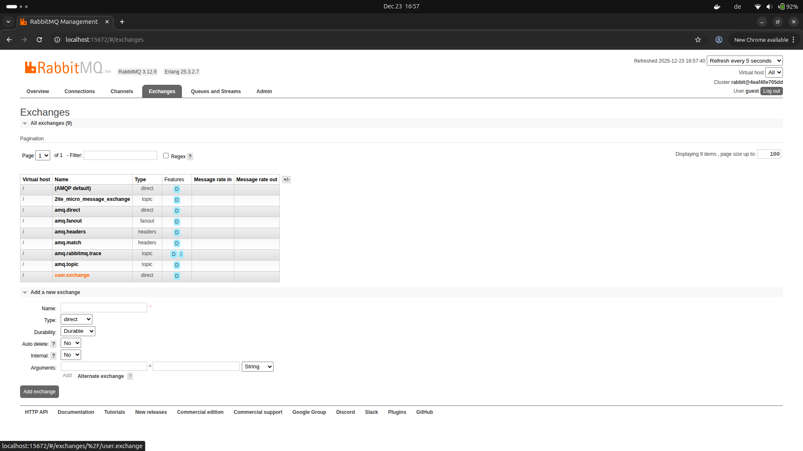
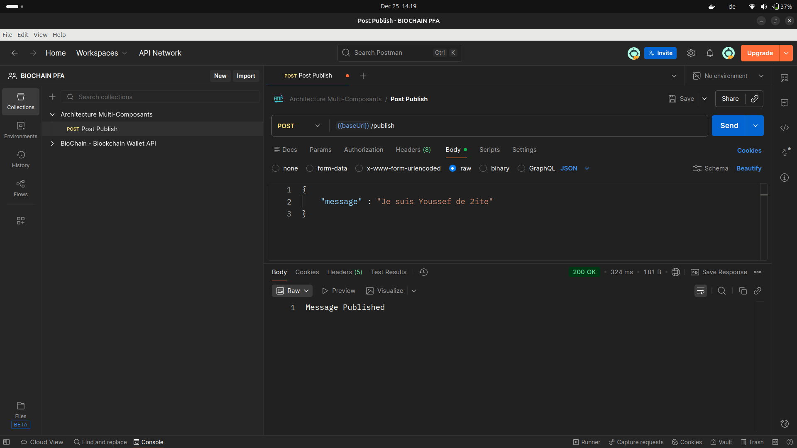
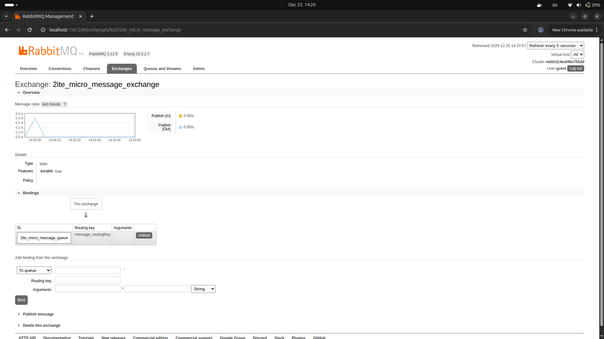
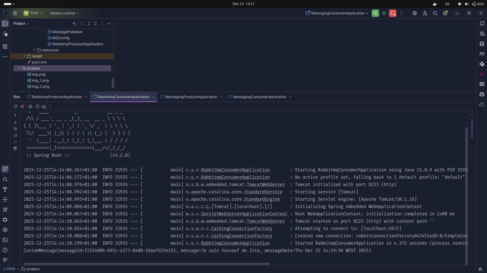
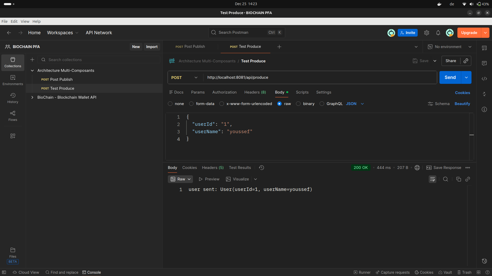
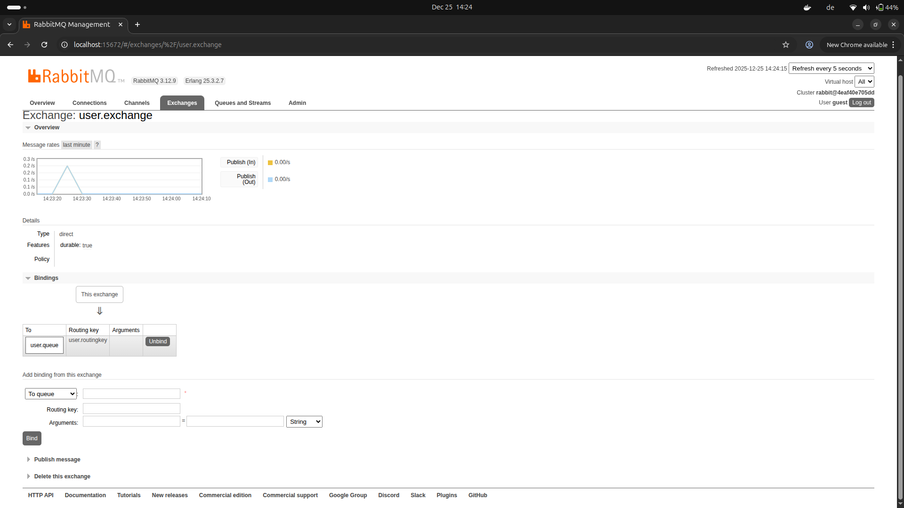
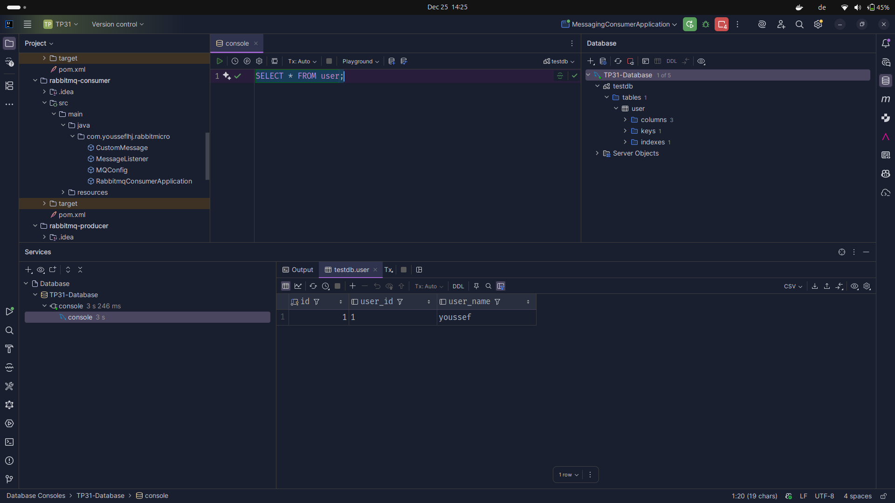

## 1. Interface de gestion RabbitMQ – Vue des échanges (Exchanges) disponibles

## 2. Configuration et publication de messages via Postman – API RabbitMQ

## 3. Détails de l’exchange « 2ite_micro_message_exchange » dans RabbitMQ

## 4. Console d'exécution du consommateur RabbitMQ (Spring Boot)

## 5. Test d’envoi de messages via l’API REST – Producteur RabbitMQ

## 6. Visualisation de l’exchange utilisateur et des bindings associés

## 7. Vérification de la persistance des messages dans la base de données
